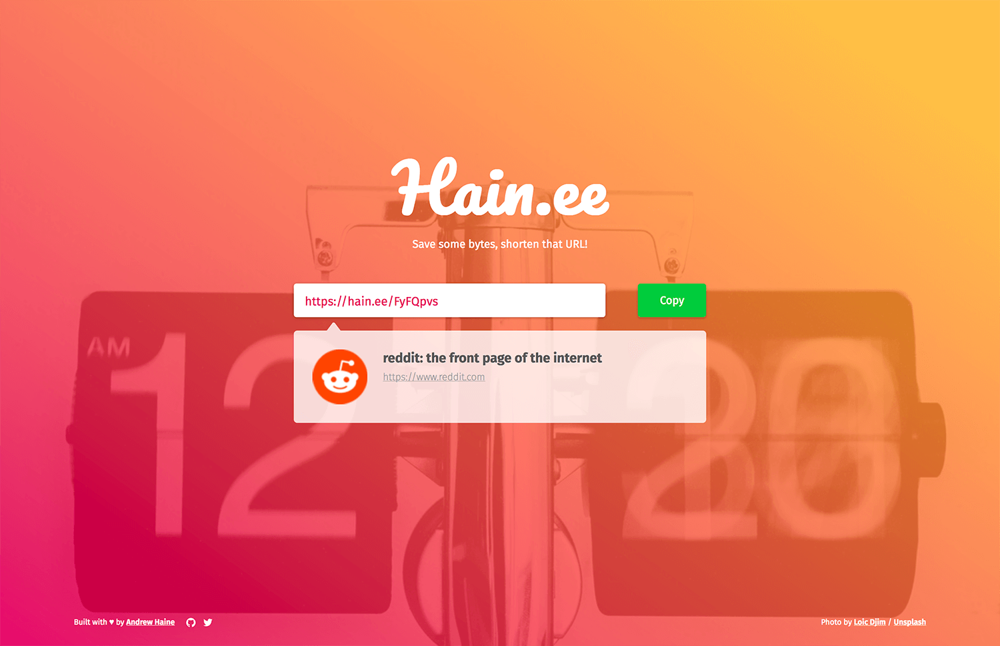

# Hain.ee   [](http://hits.dwyl.io/AndrewHaine/hainee)


A stylelish URL shortener built with NodeJS and MongoDB on the back end with React on the front end.

Awesome stock backgrounds obtained from [Unsplash](https://unsplash.com/developers)

## Instructions
Installation is simple, clone the repo, rename .env.example (to .env) and populate it with your credentials, and run ```npm install``` to grab the dependencies.

Start the app with ```npm run boot```

### Need to make some changes?
Run ```npm run dev-boot``` to start the app and watch the files, make any necessary changes. Don't forget to run ```npm run eject``` after editing any 'public' files to bundle all the assets with webpack.


## Screenshot

